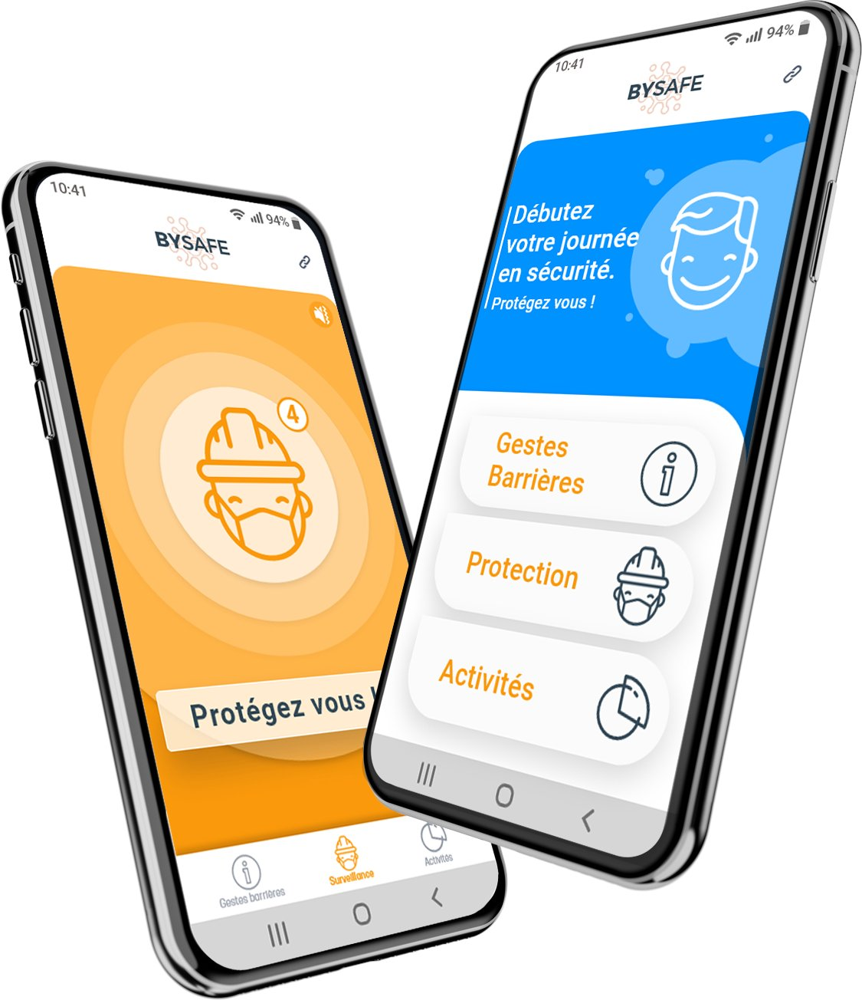
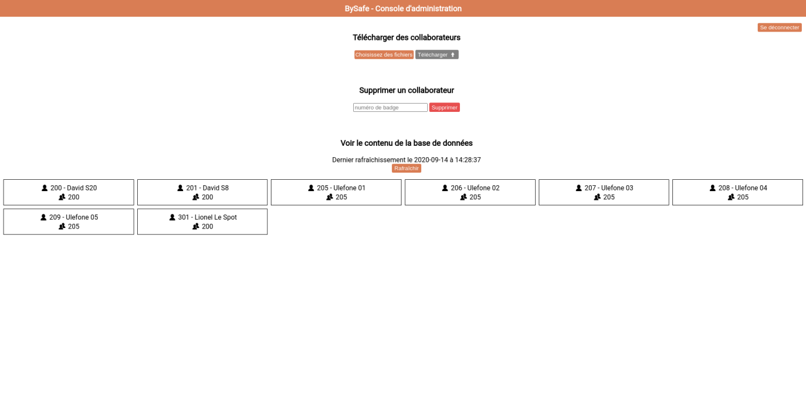

# Bysafe App

  

Bysafe is a social distancing app made by PoC students in partnership with Spot Bouygues.
The app is based on DP3T calibration-app implementation and written in Java for Android.

## Backend

The backend is in node and uses firebase and google cloud functions. It is used for user connection, contact storage and manager reports.
To create your own Firebase project, read [these instructions](back/README.MD).

## Frontend - App Compilation

Once you have created your Firebase Project, download the project config file:
`Firebase console -> your bysafe project -> settings -> Download the latest configuration file.`

Move the file in the [calibration-app/app](calibration-app/app) folder. Then:

- To build it, open `bysafe/calibration-app/app/` in Android studio and press **Build**
- To run it on your phone, plug your device to your computer, activate USB debbuging on your device, and press **Run** in Android studio

## Frontend - Admin Panel

The admin panel is in React and uses firebase and google cloud functions to add, delete or see managers and collaborators.  

  
Preview

  

 To deploy your own Admin Console, read [these instructions](admin_panel/README.MD).

## Files and lines where the backend is called
- [Authentification](https://github.com/PoCFrance/Bysafe/blame/master/calibration-app/app/src/main/java/com/bouygues/bysafe/auth/AuthActivity.java#L193)
- [Team activites report](https://github.com/PoCFrance/Bysafe/blame/master/calibration-app/app/src/main/java/com/bouygues/bysafe/report/TeamActivitiesReportFragment.java#L154)
- [Team activites](https://github.com/PoCFrance/Bysafe/blame/master/calibration-app/app/src/main/java/com/bouygues/bysafe/report/TeamActivitiesFragment.java#L111)
- [Report posting](https://github.com/PoCFrance/Bysafe/blame/master/calibration-app/app/src/main/java/com/bouygues/bysafe/MainActivity.java#L302)

## Settings and backend variables

- [Modification of the RSSI level detected](https://github.com/PoCFrance/Bysafe/blame/master/dp3t-sdk/sdk/src/main/java/org/dpppt/android/sdk/internal/AppConfigManager.java#L61)
- [Modification of scan duration and interval](https://github.com/PoCFrance/Bysafe/blame/master/dp3t-sdk/sdk/src/main/java/org/dpppt/android/sdk/internal/AppConfigManager.java#L59)
- [Handwash timer duration](https://github.com/PoCFrance/Bysafe/blame/master/calibration-app/app/src/main/java/com/bouygues/bysafe/handwash/HandwashFragment.java#L41)
- [Anonyme mode](https://github.com/PoCFrance/Bysafe/blame/master/calibration-app/app/src/main/java/com/bouygues/bysafe/auth/AuthActivity.java#L57)

## Authors
- [Killian Clette](https://github.com/Skerilyo)
- [Lorenzo Rosmarino](https://github.com/Drysque)
- [Robin Christol](https://github.com/ltsrc)
